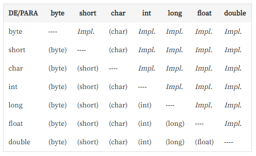
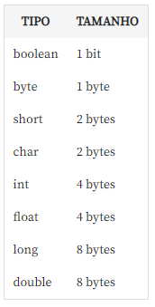

`println` - printa e quebra linha

Todo codigo java precisa obrigatoriamente esta dentro de uma `class` a comunidade define como `public`

Método `main()` - indica a função principal do programa e recebe como parametro `String[]` e `args`

No terminal digitar `type Nome.java` - ver conteudo do arquivo direto no terminal. No windows usamos o `type`

## **JRE**
`JRE = JVM + bibliotecas`

Ambiente pra executar a aplicação

## **JDK**
`JDK = JRE + ferramentas de desenvolvimento`

Ambiente para executar uma aplicação Java e possui várias ferramentas de desenvolvimento(como o compilador) mas também tem JRE embutido!.

## **JVM (Java Virtual Machine)**

A Virtual Machine só identificar arquivos `.class` -  é onde é exibido os erros da compilação

Para gerar o arquivo `.class` - formato Bytecode indentificado pela maquina. Executamos:
```
javac Programa.java
```

Chamando a Virtual Machine e executando o programa
```
java Programa
```
java + nomeDaClass
#

- Java é case sensitive não identifica letra maiuscula no inicio
- Não se usa aspas simples `''`
- O enter é opcional
- Dar espaço depois do `.`
    ```java
    public class Programa {
        public static void main(String[] args) { 
            System.
                out.println("Ola mundo");
        }
    }
    ```
- staticamente tipada - precisamos declarar o tipo antes de atribuir algum valor
#
Principais IDEs que os devs de Java usam
- netbeans(Oracle)
- intellij(Utilizado como Base para o Android utiliza o Andorid Studio)
- eclipse(Inicio com a IBM)
#

`workspace` é a pasta padrão que será utilizado para armazenar todos os projetos criados com a IDE Eclipse.
#

## **Conversão**

- O tipo `int` cabe 32 bits = 2 elevado a -31 -> 2³¹ = 2 Bilhões, passando disso começa a dar overflow
- O tipo `long` cabe 64 bits = 2 elevado a 63 = 2 Bilhões ao quadrado. Ex: `long numeroLongo = 3225424423354L` o `L` no final indica que estouramos os 2 Bilhões e que é um `literal`
- Tipo `short` cabe 16 bits = 32.767
- Tipo `byte` cabe 8 bits = 2 elevado a 8 = 127
#
### **Type casting**

Quando tentamos, porém, colocar um double numa variável do tipo inteiro temos um erro de compilação.

Esta propriedade se dá porque o Java faz conversão implícita de um tipo menor para os tipos "maiores". De inteiro para double, por exemplo.

O contrário não é verdade porque existe perda de dados quando é feita a conversão. Acarretando em um "type mismatch" mostrando que esta instrução é de tipos incompatíveis.

Para fazer uma conversão onde pode haver perda de informações é necessário fazer um type casting.
```java
int idade = (int) 30.0;
```
Será feito o cast de double para inteiro

Veja como funciona o cast implícito e explícito na tabela abaixo.



Para comparar cada tipo primitivo de forma mais clara, a tabela abaixo mostra qual o tamanho de cada um.


#
## **Char e String**
`char` cabe 16 bits
- Quando atribuimos um valor numerico ele converte para letra levando em consideração a tabela ascii
- Se não for aspas simples não compila
- Só armazena um unico caracter
- Não pode ser nulo

`String`
- `String` com s maiusculo na função é um tipo referencia 
- Não tem limite de caracteres
- Se não for aspas duplas não compila
- Converte n° para string
- Pode ser nulo
#
## **Atalho**
- Escreva `main` e apertar `ctrl + espaço`:
    ```java
    public static void main(String[] args) {

    }
    ```
- Escreva `sysout` e apertar `ctrl + espaço`:
    ```java
    System.out.println();   
    ```